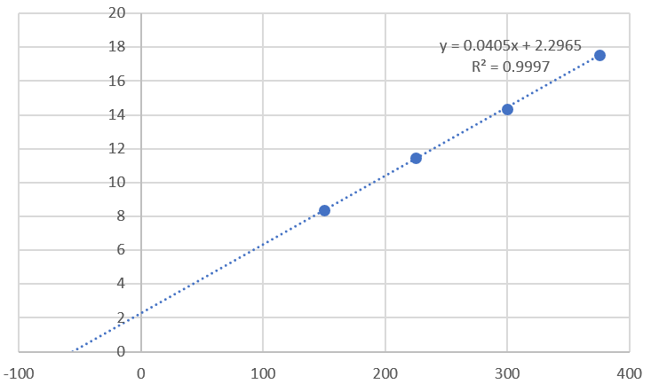
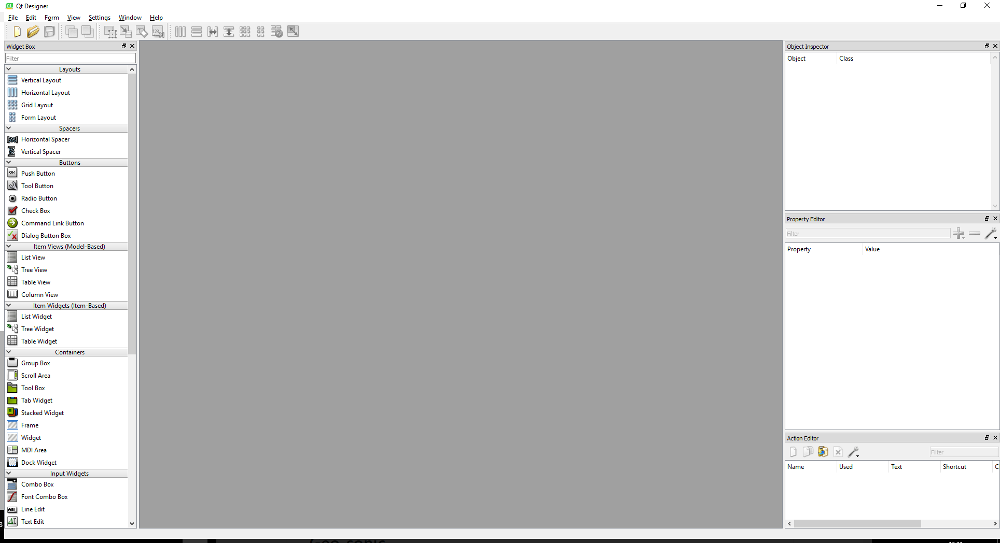
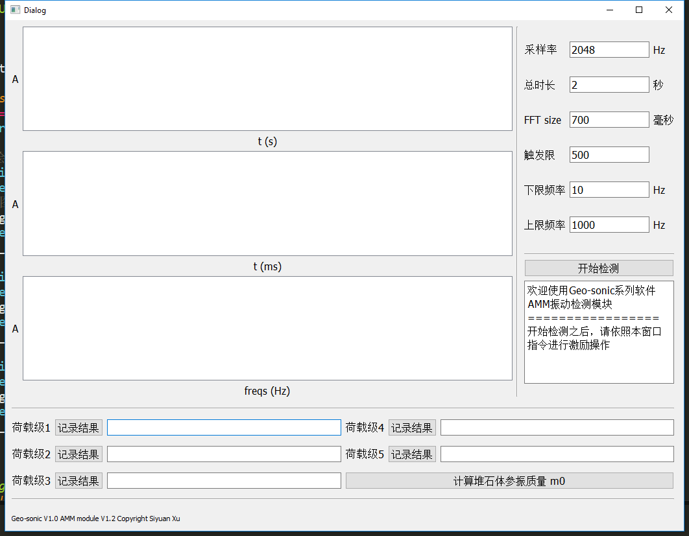

# Geo-sonic

## 前言

Geo-sonic 是本人正在开发的一个使用声音信号来分析岩土工作中的一些问题的工具包。主要目的是实现附加质量法的原位无损检测问题，可以通过分析材料的振动响应特性来帮助研究。在完成附加质量法测量密度的功能之后，会考虑拓展堆石体振动分析的应用。

## AMM 附加质量法

附加质量法是一种基于土石材料弹性阻尼模型的原位密度快速无损检测方法，通过分析土石材料在不同附加质量下的响应频率变化规律，可以通过神经网络、物理量场或者理论推解等方法确定土石材料的密度。

本仓库中的 amm_dev.py 是开发代码，amm_release.py 文件是经过测试的开发代码。

**工作路线：**

- 选择合适的振动信号拾取方法；
- 以 wav 文件格式记录下振动的时程曲线（录音）
- 对采集的信号进行截取和过滤，对受到激励的部分进行 FFT 计算，得到准确的响应主频
- 记录不同附加质量下的响应频率，得到 $\Delta D - m$ 曲线
- 采用神经网络或者数字量板计算材料的密度
- 将代码封装为qt GUI

## AMM 第一次野外试验

### 1 整体规划

在类堆石体试验区域，选择表面平整，整体材料较为密实，面积约为$1m^2$的场地作为试验场地。使用2、3、4三级荷载做检测。试验采用接触麦克风、加速度传感器、以及cm-01b三种传感器作为信号采集装置。每种信号采集装置进行10次重锤激励。

### 2 试验过程

1. 确定噪声门，通过三次测试激励来查看振动幅值和噪声幅值的区别，确定噪声门；
2. 确定噪声门的同时，通过观察每次信号衰减的时长来确定窗口时限，确定fft_size；
3. 进行多次试验，不断修改采样率rate，来得到单峰结果；
4. 施以10次锤击，记录下有效的响应频率。

### 3 注意

- 重锤的锤击高度应当保持不变
- 重锤的锤击位置距离附加质量试验点约20-30cm
- 传感器应当放置稳定
- 堆石体的振动频率约在50~80hz之间

### 4 试验结果

经过多次尝试，最终选择经过降噪的加速度传感器作为信号输入，采样率定为2048，傅里叶窗口长度定为700ms。采用两块、三块、四块、五块配重进行试验最终得到结果如下：

| 附加质量 $\Delta m$ (kg) | 共振频率 f (Hz) | $\omega=2\pi f$ | $\omega ^{-2}$  ($ms^{-2}$) |
| -------------------- | ----------- | --------------- | --------------------------- |
| 150                  | 55          | 345.5752        | 8.373651541                 |
| 225                  | 47          | 295.3097        | 11.46686098                 |
| 300                  | 42          | 263.8938        | 14.35957818                 |
| 375                  | 38          | 238.761         | 17.54175617                 |

绘制附加质量与$\omega ^{-2}$关系图如下，并对四个测试点进行线性拟合：



拟合线与x轴的交点即为m0，可以看出，试验点线性良好，m0=56.7034kg

## GUI 开发

在AMM模块的功能基本完善之后，我着手研究了python程序的GUI开发，并最终选择以pyqt5作为界面工具。

### qtdesigner 的快速设计

pyqt是在不断更新，我是用的版本是5.9.2，使用pip安装即可，但是5.6之后的版本并未继承qtdesigner工具，这个工具可以让我们通过拖动、调整等直观的方式来设计图形界面，对于我这种非专业开发者极其重要。所以还需要安装pyqt5-tools。

```shell
pip install pyqt5
pip install pyqt5-tools
```

在pyqt5-tools的路径中，可以找到并打开qtdesigner。



在designer中设计好不同的layout和widget，需要注意的是，在画界面过程中最好把不同部件的名称进行有意义的自定义，这样在后续与函数对接时更有条理。

qtdesigner非常易用，大概一个小时我就完成了界面设计，虽然简陋，但是功能都有了。



设计完ui界面后保存为*.ui 文件，再通过pyuic命令转化为python代码。

~~~shell
pyuic5 -o *.py *.ui
~~~

生成的代码差不多是下面这种格式：

~~~python
from PyQt5 import QtCore, QtGui, QtWidgets

class Ui_Dialog(object):
    def setupUi(self, Dialog):
    	blahblahblah
        self.retranslateUi(Dialog)
        
    def retranslateUi(self, Dialog):
    	blahblah
~~~

setupui部分定义了各个组件的位置和大小等

retranslateui部分定义的是一些组件的内容，比如界面上label的内容等等。连接代码和gui的部分，等会也最好也写在setupui中。

拥有了ui的python代码，我们先运行一下试试。

~~~python
if __name__ == "__main__":
    import sys
    app = QtWidgets.QApplication(sys.argv)
    MainWindow = QtWidgets.QMainWindow()
    ui = Ui_Dialog()
    ui.setupUi(MainWindow)
    MainWindow.show()
    sys.exit(app.exec_())
~~~

运行结果应该是显示出了刚刚设计的界面。不过我在一次运行中出现了错误，原因应该是setupui中出现模态设置语句，注释掉就好，对于简单的项目是没有影响的，具体问题以后再分析。

~~~python
# Dialog.setModal(False)
~~~

### 设定button与项目代码的连接

图形界面的一个主要功能：点击。先设置一个开始按钮来调用一些测试函数：在setupui函数末尾添加

~~~python
self.pushButton.clicked.connect(self.amm_test)
~~~

意思是如果pushbutton按钮被点击，就运行本类下的amm_test函数。

或者为了集中编辑，可以在setupui末尾指向另外的函数

### 在pyqt5界面中绘图

平常用python脚本画图都是使用matplotlib.pyplot 中的plot库，但是这种方式不能和qt配合工作。qt中需要的是figurecanvas和figure库来完成这些工作。网上找了个轮子先用着，在此感谢[良有以也](http://whuhan2013.github.io/blog/2017/03/28/pyqt-matplotlib-learn/) 。

- 第一步：连接qt5的backend

  ~~~python
  import matplotlib
  matplotlib.use("Qt5Agg")  # claim qt5 agg.
  from matplotlib.backends.backend_qt5agg import FigureCanvasQTAgg as FigureCanvas
  from matplotlib.figure import Figure
  from PyQt5 import QtCore, QtGui, QtWidgets
  ~~~

  需要注意的是，必须保证qtagg的连接在所有qt以及matplotlib的引用之前。

- 第二步：图形代码实现

  ~~~python
  # 继承FigureCanvas  很关键
  class Figure_Canvas(FigureCanvas):

      def __init__(self, parent=None, width=7, height=1.2, dpi=100):
          # 创建一个Figure，注意：该Figure为matplotlib下的figure，不是matplotlib.pyplot下面的figure
          fig = Figure(figsize=(width, height), dpi=dpi)
          fig.set_tight_layout(True)

          FigureCanvas.__init__(self, fig)  # 初始化父类
          self.setParent(parent)

          # 调用figure下面的add_subplot方法，类似于matplotlib.pyplot下面的subplot方法
          self.axes = fig.add_subplot(111)

      def visulizer(self, x, y):
          self.axes.plot(x, y)
  ~~~

  这一部分看代码理解，暂时不会细剖，反正使用visualizer就是了。。

  在init部分，我添加了一句

  ~~~python
  fig.set_tight_layout(True)
  ~~~

  这是为了让绘出的图更贴近边框，更紧凑，更适应gui的设计。

- 第三步，GUI上通过控件呈现matplotlib画出来的图形——通过QtWidgets.QGraphicsView控件来实现：

  ~~~python
  f2 = Figure_Canvas()
  f2.visulizer(amm_sample.x * 1000, amm_sample.y)
  graphicscene_2 = QtWidgets.QGraphicsScene()
  graphicscene_2.addWidget(f2)
  self.graphicsView_2.setScene(graphicscene_2)
  ~~~


pyqt中的图形呈现还是比较复杂的，这里是先创造了图形对象，把图形对象放到graphicscene里面，再把graphicscene设置到gui中的绘图区域组件中。

### 工作代码读取gui输入的信息

在这个项目中，我希望能够在gui中修改工作代码的运行参数，那么就需要在运行程序时获取gui文本框组件的实时内容，方法很简单，如下：

~~~python
now_text = self.text_box.text()
~~~

### 使用了 yaml 控制文件来对gui界面的初始设置进行管理

本项目中的一些参数原本是设置在gui代码中的，就是retranslateui 部分。我预期的效果是可以针对不同的工程采用不同的预制文件，但是每次都修改gui代码显然是不现实的，所以我使用了 yaml 文件来进行控制。yaml 文件可以被python作为一个dict载入。一个配置好的yaml文件如下：**don't forget the space after :**

~~~yaml
foo1: bar1
foo2: bar2
~~~

在 pip 安装pyyaml库后，可以使用load函数载入yaml文件：

~~~python
import yaml
config = yaml.load(open(config.yaml))
~~~

那么对于获得的dict对象操作就简单了。

~~~python
foo1_para = config['foo1']
~~~

### python 命令行输出内容在 gui 中的显示

在python中，print是一个非常非常非常好的函数，如何时刻关心代码运行的状态全靠它。但是在gui中，如果想要实时反馈程序状态的话还需要在工作代码和gui代码中传来传去，所以我决定在gui中添加一个文本显示区域来实时显示控制台的输出。

暂时无法解决。

### 更多的button操作

