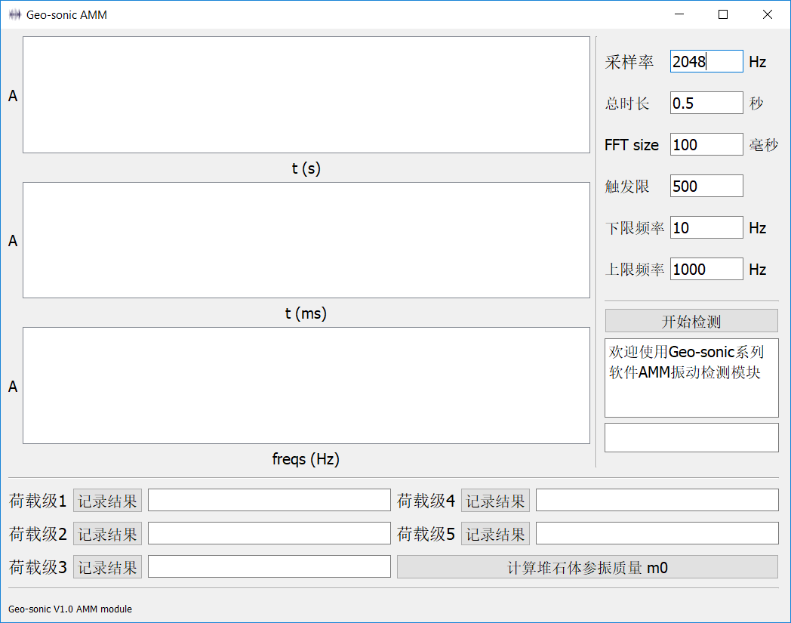

# Geo-sonic 系列软件 AMM 模块 GUI 使用说明

中文名称：堆石材料频率响应分析软件v1.0

简称：Geo-sonic v1.0

## 所需环境

- OS 支持：windows，Mac OS，Linux

- Python ：3.X

- Python 库：matplotlib | pyqt5 | scipy | pyyaml | pyaudio | wave

  - 本项目所需的三方库已经记录在 requirements.txt 中

    ```
    pip install -r requirements.txt
    ```

- 对于 Mac OS 和 Linux 系统，需要安装 portaudio

## 主要功能

该软件

## 界面介绍

在环境配置完成之后，运行 amm-gui-release.py ，软件界面如下：



软件界面依照作用不同，分为三个区域：

- A 参数设置区
- B 波形可视化区
- C 结果计算区


其中，参数测试区分别对采样率、采样时长、傅里叶快速变换的取样长度，